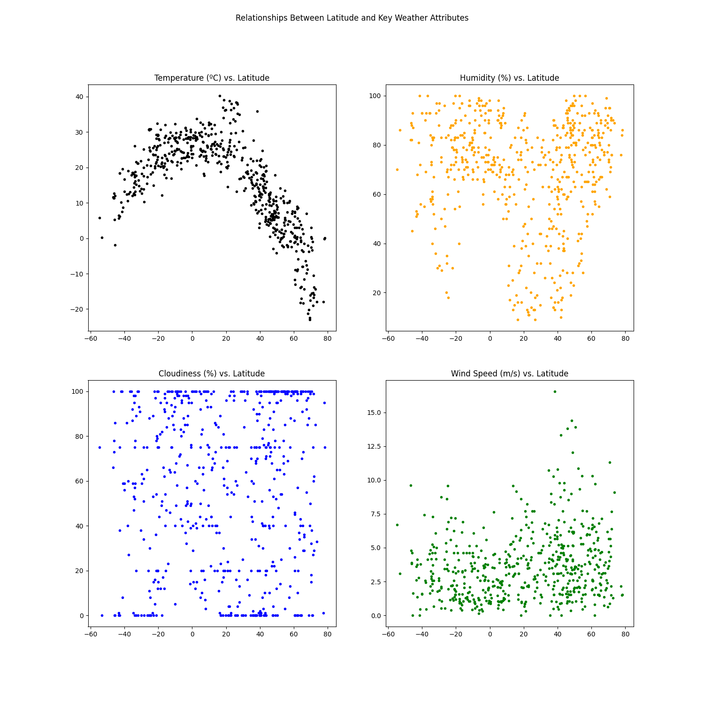

# citipy-geoapify-apis
A project exploring the `citipy` and `Geoapify` APIs to produce a dataset of randomized global cities and associated weather data.

## Procedure
This activity is broken down into two deliverables, WeatherPy and VacationPy.

#### Deliverable 1: WeatherPy
The `WeatherPy.ipynb` notebook generates random latitude/longitude combinations and uses the `citipy` library to find the closest cities to those locations. Using those city names, the OpenWeatherMap API is used to retrieve geocoding information and weather data. Regression analysis is used to fit a simple first degree polynomial model to Northern and Southern hemisphere relationships between latitude and a variety of weather attributes in the cities of interest.

**1. Create Plots to Showcase the Relationship Between Weather Variables and Latitude**
  - Use random generation techniques and the `citipy` API to create a random list of global cities.
  - Use the `OpenWeatherMap` API to retrieve weather data from the random cities list.
  - Create a series of scatter plots to showcase the following relationships:
    - _Latitude vs. Temperature_
    - _Latitude vs. Humidity_
    - _Latitude vs. Cloudiness_
    - _Latitude vs. Wind Speed_

    

**2. Compute Linear Regression for Each Relationship**
- Compute the linear regression for each relationship.
- Separate the plots into Northern Hemisphere (greater than or equal to 0 degrees latitude) and Southern Hemisphere (less than 0 degrees latitude).
- Create a series of scatter plots including the linear regression line, the model's formula, and the $r$ values:
  - _Northern Hemisphere: Temperature vs. Latitude_
  - _Southern Hemisphere: Temperature vs. Latitude_
  - _Northern Hemisphere: Humidity vs. Latitude_
  - _Southern Hemisphere: Humidity vs. Latitude_
  - _Northern Hemisphere: Cloudiness vs. Latitude_
  - _Southern Hemisphere: Cloudiness vs. Latitude_
  - _Northern Hemisphere: Wind Speed vs. Latitude_
  - _Southern Hemisphere: Wind Speed vs. Latitude_

#### Deliverable 2: VacationPy
The `VacationPy.ipynb` notebook maps the collected city data with humidity scaling marker size. Then, ideal weather condition preferences are used to restrict the data frame to a handful of viable vacation options. The Geoapify API is used to retrieve the closest hotel within 10,000 meters of the latitude/longitude retrieved for each relevant city. The same map is generated with the additional hotel information, restricted to ideal locations.

Humidity map
Narrow down the city_data_df DataFrame to find your ideal weather condition. For example:

A max temperature lower than 27 degrees but higher than 21

Wind speed less than 4.5 m/s

Zero cloudiness

NOTE
Feel free to adjust your specifications but make sure to set a reasonable limit to the number of rows returned by your API requests.

Create a new DataFrame called hotel_df to store the city, country, coordinates, and humidity.

For each city, use the Geoapify API to find the first hotel located within 10,000 meters of your coordinates.

Add the hotel name and the country as additional information in the hover message for each city on the map as in the following image:

Hotel map
